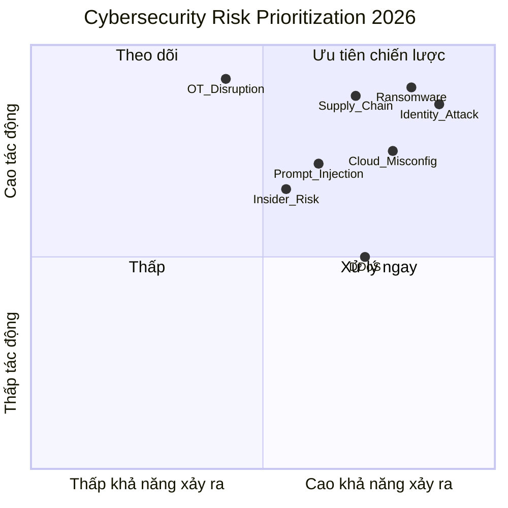
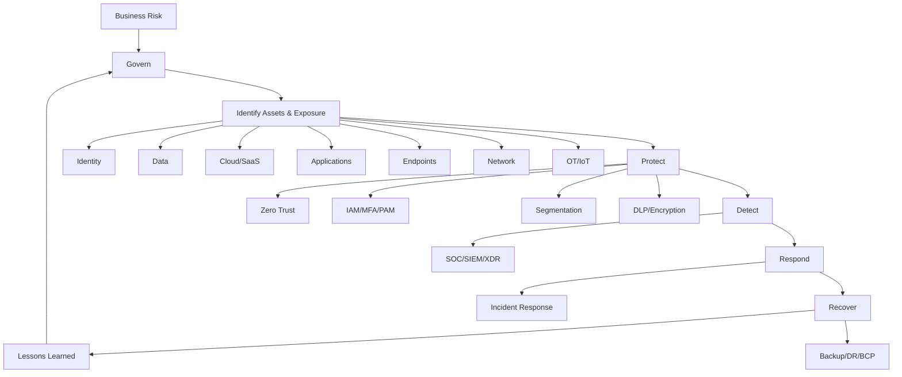
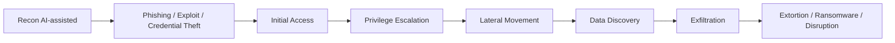
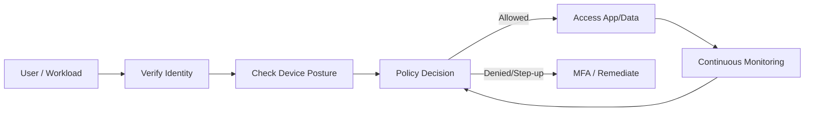
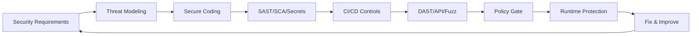
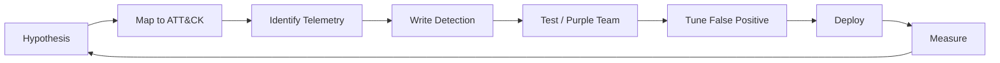
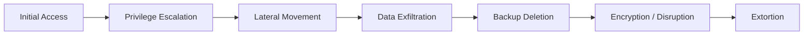
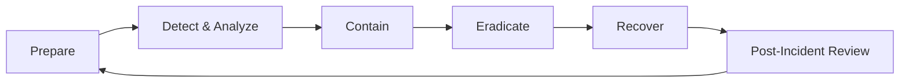

# 🛡️ Cybersecurity Cheatsheet 2026
**Title:** Cybersecurity
**Category:** Tech
> Chủ đề: **Cybersecurity Strategy · Zero Trust · Identity · Cloud · SOC · AI Security · Ransomware · Supply Chain · OT/IoT · Governance**  
> Cập nhật theo các báo cáo/thực hành mới nhất đến **04/2026**: NIST CSF 2.0, NIST AI RMF, ENISA Threat Landscape 2025, Microsoft Digital Defense Report 2025, Verizon DBIR 2025, WEF Global Cybersecurity Outlook 2026, Check Point Cyber Security Report 2026, CrowdStrike Global Threat Report 2026.

---

## 📌 Mục lục

- [1. Cybersecurity là gì?](#1-cybersecurity-là-gì)
- [2. Executive Dashboard 2026](#2-executive-dashboard-2026)
- [3. Mental Model tổng quan](#3-mental-model-tổng-quan)
- [4. Threat Landscape 2026](#4-threat-landscape-2026)
- [5. Cybersecurity Frameworks](#5-cybersecurity-frameworks)
- [6. Zero Trust Architecture](#6-zero-trust-architecture)
- [7. Identity Security](#7-identity-security)
- [8. Endpoint, EDR, XDR, MDR](#8-endpoint-edr-xdr-mdr)
- [9. Network Security & SASE](#9-network-security--sase)
- [10. Cloud & CNAPP](#10-cloud--cnapp)
- [11. Application Security & DevSecOps](#11-application-security--devsecops)
- [12. Data Security & Privacy](#12-data-security--privacy)
- [13. SOC, SIEM, SOAR & Detection Engineering](#13-soc-siem-soar--detection-engineering)
- [14. Ransomware Resilience](#14-ransomware-resilience)
- [15. AI Security & GenAI Governance](#15-ai-security--genai-governance)
- [16. Supply Chain & Third-party Risk](#16-supply-chain--third-party-risk)
- [17. OT/IoT Security](#17-otiot-security)
- [18. Post-Quantum & Crypto Agility](#18-post-quantum--crypto-agility)
- [19. Incident Response](#19-incident-response)
- [20. Metrics & KPI](#20-metrics--kpi)
- [21. 90-Day Action Plan](#21-90-day-action-plan)
- [22. Glossary](#22-glossary)
- [23. Source Notes](#23-source-notes)

---

# 1. Cybersecurity là gì?

**Cybersecurity** là năng lực bảo vệ hệ thống số, dữ liệu, danh tính, ứng dụng, hạ tầng và hoạt động kinh doanh khỏi truy cập trái phép, gián đoạn, gian lận, phá hoại hoặc rò rỉ dữ liệu.

> **Công thức ngắn gọn**

```text
Cybersecurity = Risk Management + Identity + Data Protection + Detection + Response + Resilience + Governance
```

## ✅ Mục tiêu cốt lõi

| Mục tiêu | Ý nghĩa |
|---|---|
| 🔐 **Confidentiality** | Bảo mật dữ liệu, chỉ người được phép mới truy cập |
| ✅ **Integrity** | Đảm bảo dữ liệu/hệ thống không bị sửa trái phép |
| ⚙️ **Availability** | Đảm bảo hệ thống hoạt động liên tục |
| 🧭 **Resilience** | Có khả năng phục hồi sau sự cố |
| 🛡️ **Trust** | Duy trì niềm tin của khách hàng, đối tác, cơ quan quản lý |

---

# 2. Executive Dashboard 2026

## 🔥 Top trends cần theo dõi

| Xu hướng | Ý nghĩa với doanh nghiệp | Ưu tiên |
|---|---|---|
| 🤖 **AI-powered attacks** | AI tăng tốc phishing, reconnaissance, malware, social engineering | Rất cao |
| 🧠 **AI/GenAI security** | AI trở thành attack surface mới: prompt injection, data leakage, shadow AI, agent permissions | Rất cao |
| 🔑 **Identity-first security** | Credential abuse, MFA fatigue, token theft, session hijacking tiếp tục là vector chính | Rất cao |
| 🧨 **Ransomware + data extortion** | Ransomware chuyển từ mã hóa sang đánh cắp dữ liệu, tống tiền kép/ba | Rất cao |
| ☁️ **Cloud/SaaS attack surface** | Misconfiguration, exposed secrets, CI/CD, API, SaaS identity là điểm yếu lớn | Cao |
| 🧩 **Supply chain risk** | Vendor, open-source, MSP, CI/CD và third-party integrations mở rộng blast radius | Cao |
| 🌐 **Edge/VPN/perimeter exploitation** | Router, gateway, VPN, edge devices bị khai thác nhanh, khó giám sát | Cao |
| 🏭 **OT/IoT convergence** | Rủi ro với nhà máy, logistics, năng lượng, camera, IoT, thiết bị biên | Trung bình-Cao |
| 🧬 **Post-quantum readiness** | Cần kiểm kê crypto, chuẩn bị crypto-agility | Trung bình |

## 📊 Cyber Risk Heatmap



---

# 3. Mental Model tổng quan



## 🎯 Cách nhớ nhanh

```text
Know what you have
Reduce what can be attacked
Verify every access
Detect abnormal behavior
Respond fast
Recover safely
Govern continuously
```

---

# 4. Threat Landscape 2026

## 4.1. Những điểm nóng mới nhất

| Chủ đề | Tóm tắt | Điều cần làm |
|---|---|---|
| **AI là lực khuếch đại tấn công** | AI giúp attacker tăng tốc phishing, tạo nội dung giả, tự động hóa reconnaissance và malware development | Triển khai AI governance, secure AI usage, detection cho prompt/data leakage |
| **AI systems là attack surface mới** | GenAI tools, AI agents, MCP/connectors, model/plugin permissions tạo rủi ro mới | Quản lý shadow AI, phân quyền agent, audit trail, sandbox tool execution |
| **Ransomware phân mảnh** | Các nhóm nhỏ, data-only extortion, negotiation nhanh hơn nhờ automation | Backup bất biến, tabletop exercise, segmentation, EDR/XDR, IR retainer |
| **Identity là “new perimeter”** | Stolen credentials, infostealers, token theft, session hijacking vượt qua kiểm soát truyền thống | Phishing-resistant MFA, conditional access, PAM, identity threat detection |
| **Third-party/supply chain tăng rủi ro** | Vendor, MSP, SaaS, open-source, CI/CD có thể thành đường vào | Vendor risk scoring, SBOM, secrets scanning, least privilege cho integrations |
| **Edge/perimeter devices bị khai thác nhanh** | VPN, routers, gateways, firewalls, appliances nằm ngoài EDR truyền thống | Exposure management, patch SLA, attack surface monitoring |

## 4.2. Kill Chain hiện đại



## 4.3. MITRE ATT&CK mindset

| Giai đoạn | Ví dụ kỹ thuật | Kiểm soát phòng vệ |
|---|---|---|
| Initial Access | Phishing, exposed service, exploit public-facing app | MFA, email security, WAF, patching, ASM |
| Execution | Script, macro, PowerShell, LOLBins | EDR, application control, script logging |
| Persistence | Scheduled task, account creation, cloud OAuth app | PAM, conditional access, audit OAuth apps |
| Privilege Escalation | Credential dumping, misconfig | Least privilege, LAPS, hardening |
| Defense Evasion | Disable security tools, obfuscation | Tamper protection, XDR correlation |
| Credential Access | Infostealer, token theft, LSASS dump | Credential Guard, phishing-resistant MFA, PAM |
| Discovery | AD/cloud/SaaS enumeration | Behavior analytics, UEBA |
| Lateral Movement | RDP, SMB, remote tools | Segmentation, JIT/JEA, network detection |
| Exfiltration | Cloud storage, encrypted channel | DLP, CASB, egress monitoring |
| Impact | Ransomware, wiper, data destruction | Immutable backup, DR, IR playbook |

---

# 5. Cybersecurity Frameworks

## 5.1. NIST CSF 2.0

**NIST CSF 2.0** là framework quản trị rủi ro cybersecurity cho mọi tổ chức, mọi quy mô, mọi ngành. Điểm mới quan trọng là thêm function **Govern**.

```text
Govern → Identify → Protect → Detect → Respond → Recover
```

| Function | Câu hỏi chính | Ví dụ hoạt động |
|---|---|---|
| **Govern** | Ai chịu trách nhiệm? Risk appetite là gì? | Policy, roles, risk management, board reporting |
| **Identify** | Tài sản/rủi ro nào cần quản lý? | Asset inventory, risk assessment, BIA |
| **Protect** | Làm gì để giảm khả năng bị tấn công? | IAM, MFA, encryption, training, segmentation |
| **Detect** | Làm sao phát hiện bất thường? | SOC, SIEM, XDR, detection engineering |
| **Respond** | Khi sự cố xảy ra thì xử lý thế nào? | IR plan, containment, communications |
| **Recover** | Phục hồi hoạt động ra sao? | Backup, DR, post-incident improvement |

## 5.2. Framework mapping nhanh

| Framework | Dùng để làm gì? | Khi nào dùng? |
|---|---|---|
| **NIST CSF 2.0** | Quản trị rủi ro tổng thể | Board/CISO roadmap, maturity assessment |
| **ISO/IEC 27001** | ISMS, chứng nhận quản lý an toàn thông tin | Khi cần certification/compliance |
| **CIS Controls v8** | Bộ controls thực thi thực tế | Hardening, quick wins, technical baseline |
| **MITRE ATT&CK** | Mapping tactics/techniques của attacker | SOC, detection, purple team |
| **NIST 800-207** | Zero Trust Architecture | Thiết kế ZTA |
| **NIST AI RMF** | Quản trị rủi ro AI | GenAI/AI agent governance |
| **OWASP Top 10 / API / LLM** | App/API/LLM security | DevSecOps, secure SDLC |
| **CSA CCM** | Cloud control matrix | Cloud governance |

---

# 6. Zero Trust Architecture

**Zero Trust** không phải một sản phẩm. Đây là mô hình bảo mật dựa trên nguyên tắc:

```text
Never trust, always verify
Assume breach
Verify explicitly
Use least privilege
Continuously monitor
```

## 6.1. Zero Trust Pillars

| Pillar | Câu hỏi kiểm soát | Công nghệ thường dùng |
|---|---|---|
| **Identity** | Người dùng/app/service này là ai? | IAM, MFA, SSO, PAM, CIEM |
| **Device** | Thiết bị có tin cậy không? | EDR, MDM, device compliance |
| **Network** | Kết nối có cần thiết không? | ZTNA, microsegmentation, firewall |
| **Application** | App/API có an toàn không? | WAF, API security, secure SDLC |
| **Data** | Dữ liệu nào nhạy cảm? | DLP, classification, encryption |
| **Visibility** | Có đủ telemetry không? | SIEM, XDR, NDR, CNAPP |
| **Automation** | Có phản ứng tự động không? | SOAR, policy engine |

## 6.2. Zero Trust Flow



---

# 7. Identity Security

> **Identity là perimeter mới.** Phần lớn tấn công hiện đại cố gắng đi qua bằng credential hợp lệ thay vì malware rõ ràng.

## 7.1. Các rủi ro identity phổ biến

| Rủi ro | Mô tả | Kiểm soát |
|---|---|---|
| Password spray | Thử mật khẩu phổ biến trên nhiều account | Passwordless, smart lockout, MFA |
| Phishing | Lừa người dùng nhập credential/token | Phishing-resistant MFA, awareness, email security |
| MFA fatigue | Spam push notification để người dùng approve | Number matching, FIDO2, risk-based MFA |
| Token/session theft | Đánh cắp cookie/token sau khi đăng nhập | CAE, device binding, session controls |
| Privilege creep | Quyền tích lũy theo thời gian | Access review, RBAC/ABAC |
| Service account abuse | Account máy/app có quyền cao | Secrets rotation, workload identity, PAM |
| OAuth app abuse | App độc hại xin quyền truy cập mailbox/data | OAuth app governance, admin consent workflow |

## 7.2. Identity control stack

```text
SSO + MFA/Passwordless
→ Conditional Access
→ Privileged Access Management
→ Identity Governance
→ Identity Threat Detection & Response
→ Continuous Access Evaluation
```

## 7.3. Best practices

```text
[ ] Bật phishing-resistant MFA cho admin và user rủi ro cao
[ ] Loại bỏ legacy authentication
[ ] Tách tài khoản admin và tài khoản thường
[ ] Bật PAM/JIT cho quyền cao
[ ] Review quyền định kỳ
[ ] Giám sát impossible travel, unfamiliar sign-in, token anomalies
[ ] Quản lý OAuth apps và service principals
[ ] Tắt/invalidate session khi có rủi ro cao
```

---

# 8. Endpoint, EDR, XDR, MDR

## 8.1. Khái niệm nhanh

| Thuật ngữ | Ý nghĩa |
|---|---|
| **EPP** | Endpoint Protection Platform: antivirus/anti-malware thế hệ mới |
| **EDR** | Endpoint Detection & Response: phát hiện, điều tra, phản ứng trên endpoint |
| **XDR** | Extended Detection & Response: tương quan endpoint, identity, email, cloud, network |
| **MDR** | Managed Detection & Response: dịch vụ giám sát/phản ứng bởi chuyên gia |
| **NDR** | Network Detection & Response: phát hiện bất thường trên network traffic |

## 8.2. Endpoint hardening checklist

```text
[ ] EDR agent phủ toàn bộ server/workstation
[ ] Tamper protection bật
[ ] Disk encryption bật
[ ] Local admin bị hạn chế
[ ] Application control cho máy quan trọng
[ ] PowerShell/script logging bật
[ ] Patch OS/browser/office theo SLA
[ ] USB/device control cho nhóm nhạy cảm
[ ] Baseline hardening theo CIS Benchmark
```

## 8.3. Khi nào cần MDR?

| Tình huống | Nên dùng MDR? |
|---|---|
| Không có SOC 24/7 | Rất nên |
| Thiếu threat hunting | Nên |
| Có nhiều cảnh báo nhưng thiếu analyst | Rất nên |
| Cần IR retainer/rapid response | Nên |
| Đã có SOC trưởng thành | Có thể dùng bổ sung |

---

# 9. Network Security & SASE

## 9.1. Từ perimeter sang SASE/ZTNA

Mô hình cũ dựa vào VPN/perimeter không còn đủ khi người dùng, ứng dụng, dữ liệu nằm ở nhiều nơi. **SASE** kết hợp network + security trên cloud-delivered architecture.

| Thành phần | Vai trò |
|---|---|
| **ZTNA** | Truy cập ứng dụng theo danh tính, không mở toàn mạng |
| **SWG** | Bảo vệ truy cập web |
| **CASB** | Kiểm soát SaaS/cloud app |
| **FWaaS** | Firewall-as-a-Service |
| **SD-WAN** | Kết nối chi nhánh tối ưu |
| **DEM** | Digital Experience Monitoring |

## 9.2. Network controls cần có

```text
[ ] Microsegmentation cho server/workload quan trọng
[ ] Không expose RDP/SSH trực tiếp Internet
[ ] WAF/API gateway cho public apps
[ ] DDoS protection cho dịch vụ trọng yếu
[ ] DNS security
[ ] Egress filtering và proxy logging
[ ] Network traffic analysis cho lateral movement
```

---

# 10. Cloud & CNAPP

## 10.1. CNAPP là gì?

**CNAPP – Cloud Native Application Protection Platform** là nền tảng hợp nhất bảo vệ cloud-native từ code đến runtime.

```text
CNAPP = CSPM + CWPP + CIEM + KSPM + IaC Scanning + Container Security + Runtime Protection
```

| Thành phần | Vai trò |
|---|---|
| **CSPM** | Phát hiện misconfiguration cloud |
| **CWPP** | Bảo vệ workload: VM, container, serverless |
| **CIEM** | Quản lý quyền cloud identity |
| **KSPM** | Kubernetes security posture |
| **IaC Scanning** | Scan Terraform/CloudFormation trước deploy |
| **Container Security** | Image scan, registry control, runtime defense |
| **DSPM** | Data security posture trong cloud/SaaS |

## 10.2. Cloud shared responsibility

| Lớp | Cloud provider chịu trách nhiệm | Khách hàng chịu trách nhiệm |
|---|---|---|
| Physical infra | Data center, hardware | Không |
| Platform services | Availability, core service security | Configuration, access control |
| Identity | Cung cấp IAM primitives | User/role/policy/MFA/PAM |
| Data | Storage service security | Classification, encryption, backup |
| Apps | Runtime options | Code, API, secrets, dependencies |

## 10.3. Cloud security checklist

```text
[ ] Inventory tất cả cloud accounts/subscriptions/projects
[ ] Bật MFA cho root/admin
[ ] Không dùng long-lived access keys nếu không cần
[ ] Áp dụng least privilege IAM
[ ] Bật logging: CloudTrail/Activity Log/Audit Logs
[ ] Centralize logs về SIEM
[ ] Scan misconfiguration liên tục
[ ] Encrypt data at rest/in transit
[ ] Quản lý secrets bằng vault/KMS
[ ] Backup và test restore dữ liệu cloud
```

---

# 11. Application Security & DevSecOps

## 11.1. Secure SDLC



## 11.2. AppSec toolchain

| Tool | Mục tiêu |
|---|---|
| **SAST** | Phân tích source code tìm lỗi bảo mật |
| **SCA** | Kiểm tra open-source dependencies/CVE/license |
| **DAST** | Test ứng dụng đang chạy |
| **IAST** | Kết hợp runtime + code analysis |
| **Secrets scanning** | Phát hiện API key/password/token trong code |
| **Container image scan** | Scan CVE trong image |
| **API security** | Discover, test, protect API |
| **WAF/RASP** | Bảo vệ runtime |

## 11.3. API Security

| Rủi ro API | Ví dụ | Kiểm soát |
|---|---|---|
| Broken object level authorization | User A đọc dữ liệu User B | Authorization test, object-level access check |
| Excessive data exposure | API trả quá nhiều field | Data minimization, schema governance |
| Broken authentication | Token yếu/hết hạn sai | OAuth/OIDC hardening, token validation |
| Rate limit yếu | Credential stuffing/API scraping | Rate limit, bot defense |
| Shadow API | API không được quản lý | API discovery, inventory |

---

# 12. Data Security & Privacy

## 12.1. Data security lifecycle

```text
Discover → Classify → Protect → Monitor → Retain → Delete
```

| Control | Vai trò |
|---|---|
| Data discovery | Biết dữ liệu nhạy cảm ở đâu |
| Classification | Gắn nhãn public/internal/confidential/restricted |
| Encryption | Bảo vệ dữ liệu at rest/in transit |
| DLP | Ngăn rò rỉ qua email, endpoint, cloud, web |
| DSPM | Quản lý data exposure trong cloud/SaaS |
| Key management | Quản lý KMS/HSM/rotation |
| Data retention | Giảm dữ liệu tồn dư không cần thiết |

## 12.2. Data leakage trong GenAI

| Rủi ro | Ví dụ | Kiểm soát |
|---|---|---|
| Người dùng paste dữ liệu mật vào GenAI public | Source code, hợp đồng, customer data | Enterprise GenAI, DLP, policy, training |
| RAG trả lời quá quyền | User hỏi được tài liệu không được phép | Permission-aware RAG, ACL trimming |
| Prompt injection trong tài liệu | Tài liệu chứa instruction độc hại | Treat retrieved content as untrusted data |
| Agent gọi tool sai quyền | Agent tự gửi mail/xóa dữ liệu | Human approval, least privilege, audit |

---

# 13. SOC, SIEM, SOAR & Detection Engineering

## 13.1. SOC modern stack

```text
Telemetry → Data Lake/SIEM → Detection Rules → Triage → Investigation → Response → Lessons Learned
```

| Thành phần | Vai trò |
|---|---|
| **SIEM** | Thu thập, tương quan log, tạo alert |
| **SOAR** | Tự động hóa playbook phản ứng |
| **XDR** | Tương quan tín hiệu endpoint, identity, email, cloud |
| **UEBA** | Phát hiện bất thường hành vi người dùng/entity |
| **Threat Intel** | IOC/TTP/context về attacker |
| **Case Management** | Quản lý điều tra/sự cố |
| **Detection Engineering** | Viết, test, tune detection rule |
| **Threat Hunting** | Chủ động tìm dấu hiệu xâm nhập |

## 13.2. Detection Engineering lifecycle



## 13.3. High-value detections

```text
[ ] Impossible travel / atypical sign-in
[ ] MFA fatigue / repeated denied MFA
[ ] New privileged role assignment
[ ] New OAuth app with high permission
[ ] Suspicious PowerShell or encoded command
[ ] LSASS access / credential dumping
[ ] Mass file encryption or rename
[ ] Large outbound data transfer
[ ] Cloud storage public exposure
[ ] New firewall/VPN admin login from unusual geo
[ ] Disable security tools
[ ] Creation of persistence mechanism
```

---

# 14. Ransomware Resilience

## 14.1. Ransomware lifecycle



## 14.2. Ransomware controls

| Giai đoạn | Kiểm soát chính |
|---|---|
| Before | MFA, EDR, patching, segmentation, email security, awareness |
| During | XDR/SIEM detection, containment, disable compromised accounts |
| After | Restore from immutable backup, legal/comms, lessons learned |

## 14.3. Backup strategy

```text
3-2-1-1-0 Rule
3 copies of data
2 different media
1 offsite copy
1 immutable/offline copy
0 restore errors through regular testing
```

## 14.4. Ransomware readiness checklist

```text
[ ] Immutable backup cho hệ thống trọng yếu
[ ] Test restore định kỳ
[ ] Network segmentation cho crown jewels
[ ] EDR/XDR trên server quan trọng
[ ] Disable legacy protocols nếu không cần
[ ] IR playbook và contact list sẵn sàng
[ ] Tabletop exercise ít nhất 2 lần/năm
[ ] Legal, PR, executive escalation plan rõ ràng
```

---

# 15. AI Security & GenAI Governance

## 15.1. AI Security là gì?

**AI Security** gồm hai lớp:

```text
Using AI for Security  = dùng AI để phát hiện/phản ứng tốt hơn
Securing AI Systems    = bảo vệ model, app, data, prompt, agent, tools
```

## 15.2. GenAI/Agent attack surface

| Attack Surface | Rủi ro | Kiểm soát |
|---|---|---|
| Prompt | Prompt injection, jailbreak | Input validation, policy layer, output filter |
| Context/RAG | Data poisoning, retrieved instruction | Source trust, ACL trimming, citation, sandbox |
| Model | Model theft, adversarial manipulation | Access control, monitoring, red teaming |
| Tools/Plugins | Tool abuse, over-permission | Least privilege, allowlist, human approval |
| Memory | Sensitive data retention | Data minimization, retention policy |
| Agent workflow | Autonomous harmful action | HITL, audit trail, policy engine |
| MCP/connectors | Connector compromise, excessive trust | Connector inventory, auth, secrets rotation |

## 15.3. Secure AI governance checklist

```text
[ ] Inventory tất cả AI/GenAI tools đang dùng
[ ] Phân loại use case theo risk level
[ ] Chặn hoặc kiểm soát shadow AI
[ ] Enterprise AI gateway/proxy cho logging & DLP
[ ] Không đưa dữ liệu mật vào public AI nếu chưa kiểm soát
[ ] Permission-aware RAG
[ ] Red team prompt injection/jailbreak/data leakage
[ ] Human approval cho agent action/write-back
[ ] Audit log toàn bộ prompt/tool call/output quan trọng
[ ] Áp dụng NIST AI RMF cho governance
```

## 15.4. AI SOC use cases

| Use case | Giá trị |
|---|---|
| Alert triage | Giảm noise, ưu tiên sự cố thật |
| Log summarization | Tóm tắt timeline sự cố nhanh |
| Threat hunting assistant | Gợi ý hypothesis và query |
| Malware/script explanation | Hỗ trợ analyst đọc code/script |
| Phishing detection | Phân tích ngôn ngữ, URL, attachment |
| Incident report drafting | Tạo báo cáo IR nhanh hơn |

---

# 16. Supply Chain & Third-party Risk

## 16.1. Supply chain risk map

```text
Vendor/SaaS/MSP
Open-source dependency
CI/CD pipeline
Container registry
Secrets/API keys
Build system
Identity federation
Data processor/subcontractor
```

## 16.2. Kiểm soát trọng yếu

| Control | Mục tiêu |
|---|---|
| Vendor due diligence | Đánh giá security trước khi mua |
| Contract clauses | Yêu cầu bảo mật, audit, breach notification |
| SBOM | Biết thành phần phần mềm |
| SCA | Scan dependency CVE/license |
| Code signing | Đảm bảo integrity của build/artifact |
| Secrets scanning | Ngăn lộ secrets trong repo/pipeline |
| CI/CD hardening | Bảo vệ pipeline khỏi tampering |
| Third-party access review | Kiểm soát quyền vendor/MSP |
| Continuous monitoring | Theo dõi exposure/risk sau khi onboard |

## 16.3. Vendor risk tiers

| Tier | Ví dụ | Yêu cầu bảo mật |
|---|---|---|
| Tier 1 - Critical | Core cloud, ERP, IAM, payment, MSP | Audit, pen test, SLA, BCP/DR, breach notification |
| Tier 2 - High | SaaS xử lý dữ liệu nhạy cảm | SOC2/ISO, DPA, SSO/MFA, logging |
| Tier 3 - Medium | Tool nội bộ ít dữ liệu nhạy cảm | Security questionnaire, access review |
| Tier 4 - Low | Dịch vụ không xử lý dữ liệu quan trọng | Basic due diligence |

---

# 17. OT/IoT Security

## 17.1. OT/IT khác nhau thế nào?

| Tiêu chí | IT | OT |
|---|---|---|
| Ưu tiên | Confidentiality/Integrity/Availability | Safety/Availability/Integrity |
| Vòng đời thiết bị | 3-5 năm | 10-30 năm |
| Patch | Thường xuyên | Khó, cần downtime/validation |
| Giao thức | TCP/IP, HTTP, SaaS | Modbus, DNP3, Profinet, OPC UA |
| Rủi ro | Data breach | Gián đoạn sản xuất, an toàn vật lý |

## 17.2. OT security controls

```text
[ ] Asset discovery thụ động cho OT
[ ] Network segmentation IT/OT
[ ] Jump server/bastion cho remote access
[ ] MFA cho vendor access
[ ] Allowlist protocol/traffic
[ ] Backup PLC/SCADA config
[ ] Monitor bất thường trong ICS protocol
[ ] Incident response playbook riêng cho OT
[ ] Không scan chủ động nếu chưa đánh giá rủi ro
```

---

# 18. Post-Quantum & Crypto Agility

## 18.1. Vì sao cần chuẩn bị?

Máy tính lượng tử đủ mạnh có thể làm suy yếu một số thuật toán public-key hiện nay. Doanh nghiệp chưa cần “panic”, nhưng cần bắt đầu **crypto inventory** và **crypto-agility**.

## 18.2. Roadmap crypto-agility

```text
1. Inventory: hệ thống nào dùng TLS, VPN, PKI, code signing, HSM?
2. Classify: dữ liệu nào cần bảo mật dài hạn?
3. Assess: thuật toán/key length/cert lifecycle hiện tại
4. Plan: ưu tiên hệ thống có dữ liệu dài hạn hoặc public exposure
5. Test: thử nghiệm PQC/hybrid certificates khi vendor hỗ trợ
6. Govern: chính sách crypto lifecycle và migration roadmap
```

---

# 19. Incident Response

## 19.1. IR lifecycle



## 19.2. Incident severity matrix

| Severity | Ví dụ | Thời gian phản ứng |
|---|---|---|
| Sev 1 - Critical | Ransomware lan rộng, data exfiltration, production outage | Ngay lập tức, war room |
| Sev 2 - High | Compromised admin, malware trên server quan trọng | < 1 giờ |
| Sev 3 - Medium | Phishing thành công nhưng chưa lan rộng | < 4 giờ |
| Sev 4 - Low | Alert đơn lẻ, không có impact | Theo SLA |

## 19.3. IR checklist nhanh

```text
[ ] Xác nhận sự cố và scope ban đầu
[ ] Bảo toàn evidence/log
[ ] Cô lập endpoint/account/network segment bị ảnh hưởng
[ ] Reset credential/token liên quan
[ ] Kiểm tra persistence/lateral movement
[ ] Đánh giá data exposure
[ ] Khôi phục từ backup sạch
[ ] Giao tiếp với executive/legal/PR/customer nếu cần
[ ] Viết post-incident report và cải tiến controls
```

---

# 20. Metrics & KPI

## 20.1. Executive KPIs

| KPI | Ý nghĩa | Mục tiêu tham khảo |
|---|---|---|
| Security maturity score | Mức trưởng thành theo NIST/ISO/CIS | Tăng theo quý |
| Critical asset coverage | % crown jewels có controls đầy đủ | > 95% |
| MFA coverage | % user/admin bật MFA/passwordless | > 98%, admin 100% |
| EDR coverage | % endpoint/server có EDR | > 95% |
| Critical patch SLA | % critical vuln vá đúng hạn | > 90% |
| MTTD | Mean Time To Detect | Giảm theo quý |
| MTTR | Mean Time To Respond/Recover | Giảm theo quý |
| Backup restore success | % restore test thành công | > 95% |
| Phishing report rate | % user báo cáo phishing | Tăng theo quý |
| Third-party risk reviewed | % vendor critical được review | 100% |

## 20.2. SOC metrics

| Metric | Dùng để đo |
|---|---|
| Alert volume by severity | Noise và workload |
| False positive rate | Chất lượng detection |
| Detection coverage by ATT&CK | Khoảng trống detection |
| Time to triage | Tốc độ xử lý L1/L2 |
| Incident recurrence | Chất lượng remediation |
| Automation rate | Mức độ SOAR/use case tự động |

---

# 21. 90-Day Action Plan

## Phase 1 — 0-30 ngày: Baseline & Quick Wins

```text
[ ] Asset inventory: endpoint, server, cloud, SaaS, identity, OT/IoT
[ ] Bật MFA cho admin và user rủi ro cao
[ ] Kiểm tra backup critical systems và test restore
[ ] Vá critical vulnerabilities trên Internet-facing systems
[ ] Bật logging trọng yếu: identity, endpoint, firewall, cloud, email
[ ] Review admin accounts và privileged roles
[ ] Chặn legacy authentication
```

## Phase 2 — 31-60 ngày: Detection & Control

```text
[ ] Triển khai/tối ưu EDR/XDR coverage
[ ] Centralize logs vào SIEM
[ ] Viết detection cho identity attack, ransomware, data exfiltration
[ ] Thiết lập vulnerability management SLA
[ ] Bắt đầu vendor risk review cho Tier 1/Tier 2
[ ] Cloud posture scan và fix misconfiguration critical
[ ] Chính sách GenAI/AI tools và shadow AI inventory
```

## Phase 3 — 61-90 ngày: Resilience & Governance

```text
[ ] Tabletop exercise ransomware/credential breach
[ ] Xây dựng executive cyber dashboard
[ ] Mapping NIST CSF 2.0 maturity và target profile
[ ] Thiết kế Zero Trust roadmap
[ ] PAM/JIT cho admin critical
[ ] IR retainer hoặc MDR nếu thiếu SOC 24/7
[ ] AI security governance theo NIST AI RMF
```

---

# 22. Glossary

| Thuật ngữ | Giải thích ngắn |
|---|---|
| **ASM** | Attack Surface Management - quản lý bề mặt tấn công |
| **BIA** | Business Impact Analysis - phân tích tác động kinh doanh |
| **CASB** | Cloud Access Security Broker - kiểm soát truy cập SaaS/cloud |
| **CIEM** | Cloud Infrastructure Entitlement Management - quản lý quyền cloud |
| **CNAPP** | Cloud Native Application Protection Platform |
| **CSPM** | Cloud Security Posture Management |
| **CWPP** | Cloud Workload Protection Platform |
| **DLP** | Data Loss Prevention |
| **DR** | Disaster Recovery |
| **EDR** | Endpoint Detection and Response |
| **HITL** | Human-in-the-loop |
| **IAM** | Identity and Access Management |
| **IR** | Incident Response |
| **KSPM** | Kubernetes Security Posture Management |
| **MDR** | Managed Detection and Response |
| **MFA** | Multi-Factor Authentication |
| **NDR** | Network Detection and Response |
| **PAM** | Privileged Access Management |
| **RAG** | Retrieval Augmented Generation |
| **SASE** | Secure Access Service Edge |
| **SBOM** | Software Bill of Materials |
| **SCA** | Software Composition Analysis |
| **SIEM** | Security Information and Event Management |
| **SOAR** | Security Orchestration, Automation and Response |
| **UEBA** | User and Entity Behavior Analytics |
| **WAF** | Web Application Firewall |
| **XDR** | Extended Detection and Response |
| **ZTNA** | Zero Trust Network Access |

---

# 23. Source Notes

> Các nguồn tham khảo chính dùng để cập nhật cheatsheet này:

| Mã | Nguồn | Nội dung tham khảo chính |
|---|---|---|
| S1 | NIST Cybersecurity Framework 2.0, 2024 | Govern/Identify/Protect/Detect/Respond/Recover, governance và risk management |
| S2 | NIST AI Risk Management Framework + GenAI Profile + 2026 Critical Infrastructure concept note | AI governance, trustworthy AI, GenAI risk |
| S3 | ENISA Threat Landscape 2025 | Threat landscape, ransomware, AI phishing, incidents EU |
| S4 | Microsoft Digital Defense Report 2025 | Ransomware/extortion, identity, MFA, AI threat acceleration |
| S5 | Verizon Data Breach Investigations Report 2025 | Breach patterns, third-party risk, ransomware, credentials, human factor |
| S6 | World Economic Forum Global Cybersecurity Outlook 2026 | AI as key driver, geopolitics, supply chain, resilience |
| S7 | Check Point Cyber Security Report 2026 | AI-assisted attack lifecycle, AI prompt risk, fragmented ransomware, edge devices |
| S8 | CrowdStrike Global Threat Report 2026 | AI-enabled adversaries, breakout time, cloud/identity/SaaS intrusion patterns |

---

# ✅ Final Takeaway

```text
Cybersecurity 2026 = Identity-first + AI-aware + Cloud-native + Resilience-driven + Governance-led
```

> **Không chỉ mua thêm tool.**  
> Cần quản trị rủi ro, giảm attack surface, bảo vệ identity/data, phát hiện nhanh, phản ứng có quy trình, phục hồi được và đo lường liên tục.

```text
Think risk. Verify identity. Protect data. Detect behavior. Respond fast. Recover safely.
```
